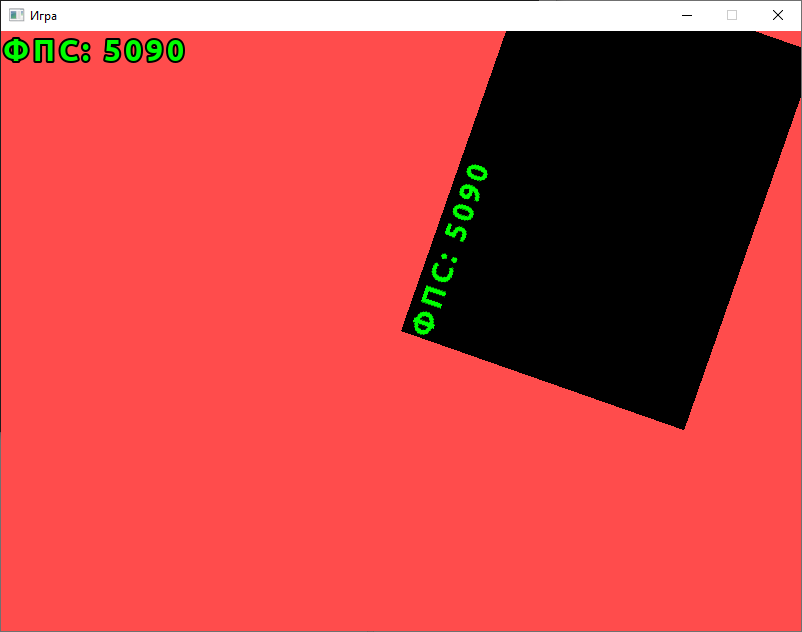
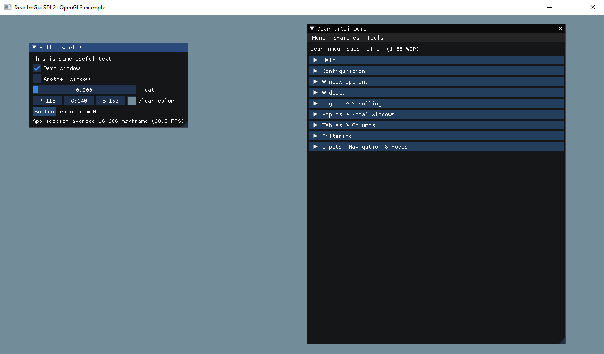

# Dviglo

Игровой движок.

## Скриншоты для привлечения внимания





## Особенности

* Использование языка C++20
* Максимальная модульность
* Ориентация на русскоязычное сообщество

## Быстрый старт

### Скачивание репозитория

1. Скачайте и установите `git` с <https://git-scm.com> или с <https://gitforwindows.org> (это одна и та же программа)
2. Создайте пустую папку и в ней батник `скачать реп.bat`:

```
:: Меняем кодировку консоли на UTF-8
chcp 65001

:: Путь к git.exe
set "PATH=c:\Program Files\Git\bin"

:: Качаем репозиторий в папку repo
git clone https://github.com/dviglo/dviglo_01 repo

:: Ждём нажатия ENTER перед закрытием консоли
pause
```

3. Запустите батник

### Обновление репозитория

Для обновления локального репозитория из удалённого (remote) репозитория создайте и используйте батник `обновить реп.bat`:

```
chcp 65001

set "PATH=c:\Program Files\Git\bin"

:: Переходим в папку репозитория
cd repo

:: Обновляем
git pull

pause
```

### Компиляция

На данный момент единственным компилятором, который более-менее поддерживает C++20, является `Visual Studio 2022 v17.0 Preview 4.0`.
Скачать можно отсюда: <https://docs.microsoft.com/en-us/visualstudio/releases/2022/release-notes-preview>.
Также необходимо [скачать последнюю версию CMake](https://cmake.org), который наконец-то стал понимать, что cppm-файлы - это модули C++20.

CMake генерирует проекты для конкретного компилятора (в нашем случае это Visual Studio) из конфигов `CMakeLists.txt`.
Создайте батник `сгенерировать проекты.bat` рядом с папкой `repo`:

```
:: Этот батник нужно запускать от Админа, чтобы не копировать папки с данными, а просто создавать символические ссылки на них
:: (команда mklink требует админских прав)

chcp 65001

:: Проверяем, что батник запущен от Админа. Для этого запускаем программу, которая требует админских прав.
:: Если возникает ошибка, значит батник запущен не от Админа.
:: 2>&1 редиректит stderr в stdout.
:: >nul редиректит stdout в nul (эквивалентно 1>nul).
:: https://support.microsoft.com/ru-ru/help/110930/redirecting-error-messages-from-command-prompt-stderr-stdout
@echo off
net session >nul 2>&1
if %errorLevel% neq 0 (
    echo Запустите батник от Админа
    pause
    exit /b
)
@echo on

:: При запуске батника от Админа меняется текущий путь. Фиксим это
cd /D "%~dp0"

:: Указываем путь к cmake.exe
set "PATH=c:\Programs\CMake\bin"

:: Создаём проекты для Visual Studio 2020 в папке build_vs17, используя конфиг CMakeLists.txt из папки repo
cmake repo -B build_vs17 -G "Visual Studio 17" -D dviglo_win_console=1 -D dviglo_build_all_libs=1

pause
```

Для запуска батника от Админа: ПКМ по батнику -> `Запуск от имени администратора`.

Будет создана папка `build_vs17` с проектами. Можно скомпилировать проекты, открыв их в Студии, а можно с помощью батника:

```
chcp 65001

set "PATH=c:\Programs\CMake\bin"

:: Компилируем проекты в папке build_vs17
cmake --build build_vs17 --config Debug
::cmake --build build_vs17 --config Release

pause
```

**ВНИМАНИЕ!** Подразумевается, что `cmake.exe` находится в папке `c:\Programs\CMake\bin`. Если это не так, то измените батники.

После компиляции экзешники появятся в папке `build_vs17\bin`.
