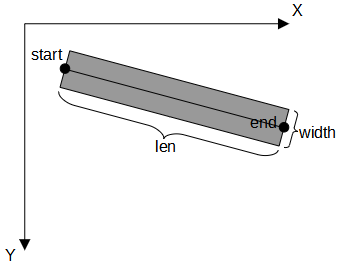
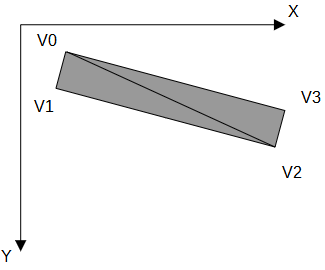
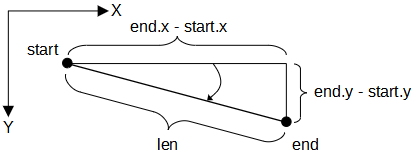
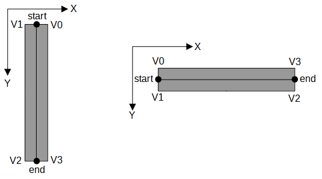
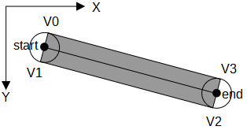

# Рисование прямой

Функция `void fill_line(const vec2& start, const vec2& end, float width)` рисует закрашенный прямоугольник с толщиной width.



----------------------------------------------------

Для того, чтобы нарисовать прямоугольник, нужно нарисовать два треугольника.



Каждый треугольник рисуется против часовой стрелки:

```
fill_triangle(v0, v1, v2);
fill_triangle(v0, v2, v3);
```

----------------------------------------------------

Мы можем легко вычислить косинус и синус угла наклона прямой:



```
float cosine = (end.x - start.x) / len; // Отношение прилежащего катета к гипотенузе
float sine = (end.y - start.y) / len; // Отношение противолежаещего катета к гипотенузе
```

----------------------------------------------------

Положение точки `v0` зависит от положения точки `start` и от наклона прямой по какой-то формуле.
Формулы - это не так наглядно, попробуем догадаться.



Отрезок [`start`, `v0`] перепендикулярен отрезку [`start`, `end`].

Когда отрезок [`start`, `end`] строго вертикален (sin 90° = 1, cos 90° = 0), отрезок [`start`, `v0`] строго горизонтален.
Координаты точки `v0 = vec2(start.x + half_width, start.y)`, что можно записать как `v0 = vec2(start.x + half_width * 1, start.y ± half_width * 0)` или
`v0 = vec2(start.x + half_width * sine, start.y ± half_width * cosine)`.

Когда отрезок [`start`, `end`] строго горизонтален (sin 0° = 0, cos 0° = 1), отрезок [`start`, `v0`] строго вертикален.
Координаты точки `v0 = vec2(start.x, start.y - half_width)`, что можно записать как `v0 = vec2(start.x ± half_width * 0, start.y - half_width * 1)` или
`v0 = vec2(start.x ± sine * 0, start.y - half_width * cosine)`.

Т.е. координаты точки `v0 = vec2(start.x + half_width * sine, start.y - half_width * cosine)`.

----------------------------------------------------

При наклоне прямой на разные углы, точки `v0` и `v1` описывают вокруг точки `start` окружность с радиусом `half_width`.
А точки `v2` и `v3` описывают такую-же окружность вокруг точки `end`.



Смещение точки `v0` от точки `start`: `v0_offset = vec2(half_width * sine, -half_width * cosine)`. Смещение точки `v3` от точки `end` точно такое же.

Смещение точки `v1` от точки `start` имеет противоположный от `v0_offset` знак по обеим осям: когда `v0` движется вправо, `v1` движется влево; когда `v0` поднимается, `v1` опускается. Смещение точки `v2` от точки `end` такое же.

```
vec2 v0 = start + v0_offset;
vec2 v3 = end + v0_offset;
vec2 v1 = start - v0_offset;
vec2 v2 = end - v0_offset;
```
